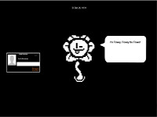

# Flowey-MDM-Theme

This is a fan-made MDM **html5 theme** based on (inspired by) the character **Flowey** from the game [Undertale](http://undertale.com/).

## Installation

To use this theme you have to extract it to the following folder:

`/usr/share/mdm/html-themes`

You can easily achieve this by cloning the repository to the above folder.

    cd /usr/share/mdm/html-themes
    git clone https://github.com/cs-turbo/flowey-mdm-theme.git

After extracting the repository to the above folder you can run the following command:

`/usr/sbin/mdmsetup`

Within the **Theme** tab you should be able to select the Flowey Theme.

And there you go! Please note that this theme is optimized for the resolution **1920x1080**

## Customization
To change the settings (default sprites, texts, sprite change rate ...) of the theme you can edit the **sprites.con.js** file.

The following variables are defined:

- **floweyRotationTime**
  - you can set the rotation time for the sprites. The default is 5000 ms ( =5 sec. )

- **floweyUseWinkAsDefault**
  - you can decide if the wink sprite is used as default. When it is a false a random sprite will be used.

- **floweySpriteConfig**
  - An Array containing JSON Objects that define the sprites used. The format for the JSON Object is the following:

`name: The name of the jpg file (sprite) within the img folder prefixed with a #`

`text: The text that will be displayed within the speech bubble when the sprite is showing`

    {
    name: "#flowey_wink"
    text: "lorem ipsum"
    }

If you want to use png images instead just adjust the **imgExtension** variable wihtin **flowey.class.js**

## Copyright
Character image used with permission: Flowey from UNDERTALE (C) Toby Fox 2013 - 2016

Other resources are [WTFPL](https://de.wikipedia.org/wiki/WTFPL) by cs-turbo ( Pascal Strohmeyer )
